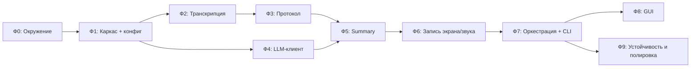

# Дорожная карта реализации «Meeting Recorder»

**Сопутствующий документ:** `meeting-recorder-spec.md`
**Аудитория:** один разработчик (внутренний инструмент)
**Подход:** итеративный; самый рискованный ML-конвейер валидируется рано на стабильных входах, платформенно-зависимая запись интегрируется в конце.

---

## 0. Принцип очерёдности

Очевидный путь — строить строго по порядку пайплайна (запись → транскрипция → отчёт). Но это **не оптимально**, потому что запись экрана и системного звука в Windows — самый капризный и платформенно-зависимый узел, а отлаживать ML-цепочку на его нестабильном выходе тяжело.

Поэтому порядок работ перевёрнут относительно потока данных:

1. Сначала **окружение** (CUDA/torch/WhisperX — самая частая причина потерянных дней).
2. Затем **цепочка «аудио → транскрипт → протокол → summary»** на заранее подготовленном WAV-файле (записанном чем угодно). Это ядро ценности продукта; его можно полностью отладить, не имея рабочей записи экрана.
3. И только потом — **модуль записи** (самый рискованный) и финальная интеграция.

Так основная логика стабилизируется на воспроизводимых входах, а Windows-специфика остаётся последней изолированной задачей.

Оценка трудоёмкости дана относительно: **S** (часы), **M** (день-два), **L** (несколько дней).

---

## Фаза 0 — Подготовка окружения · **M**

**Цель:** работающее окружение со всеми тяжёлыми зависимостями до написания логики.

**Задачи:**

- Установить Python 3.11+, создать `venv`.
- Установить `ffmpeg`, проверить из консоли (`ffmpeg -version`).
- Установить `torch` под нужную CUDA (или CPU-сборку) — **строго по версии CUDA драйвера**; это главный источник проблем.
- Установить `whisperx` и зависимости (`faster-whisper`, `pyannote.audio`).
- Получить токен HuggingFace, принять условия gated-моделей `pyannote/speaker-diarization`.
- Поднять локальный `llama-server` (llama.cpp) с тестовой моделью; проверить `curl` к `/v1/chat/completions`.
- Получить ключ OpenRouter, проверить тот же запрос к их endpoint.

**Критерий готовности (DoD):**

- WhisperX распознаёт тестовый WAV и возвращает сегменты (хотя бы из CLI/скрипта).
- Диаризация отрабатывает на тестовом файле без ошибок токена.
- Оба LLM-бэкенда отвечают на пробный chat-запрос.

**Риски:** несовпадение версий CUDA/torch; gated-доступ к pyannote; нехватка VRAM под `large-v3` (план Б — `medium`).

---

## Фаза 1 — Каркас проекта и конфигурация · **S–M**

**Цель:** структура проекта, типизированный конфиг, логирование, генерация имён.

**Задачи:**

- Создать структуру пакета по §5.1 спецификации.
- `config.py`: pydantic-модели под `config.yaml` (секции `recording`, `transcription`, `llm`), переопределение секретов из переменных окружения, валидация значений.
- `naming.py`: генерация `session_id = meeting_<YYYY-MM-DD>_<HH-MM-SS>`, разрешение коллизий суффиксом, формирование путей всех артефактов и создание подпапки сессии.
- Настроить `logging` (консоль + файл, тайминги этапов).

**DoD:**

- `config.yaml` загружается и валидируется; неверные значения дают понятную ошибку.
- `naming` генерирует корректные файлобезопасные пути; покрыто юнит-тестами (включая коллизию в одну секунду).

**Риски:** низкие.

---

## Фаза 2 — Транскрипция и диаризация · **M–L**

**Цель:** `transcriber.py`, превращающий аудиофайл в структурированный транскрипт.

**Задачи:**

- Обёртка над WhisperX: загрузка модели (с учётом `device`), транскрипция, выравнивание, диаризация.
- Формирование `*_transcript.json` строго по схеме из §6.4 спецификации.
- Сопоставление меток говорящих с именами из конфига (если заданы).
- Ленивая/кэшируемая загрузка моделей (не грузить на каждый вызов).
- Деградация на CPU с предупреждением, если `cuda` недоступна.

**DoD:**

- На тестовом WAV с 2+ говорящими получается валидный JSON с корректными `speaker`, таймкодами и текстом.
- Повторный запуск над тем же файлом воспроизводим.

**Риски:** качество диаризации на перекрывающейся речи; скорость на CPU. Тестировать на реальном фрагменте встречи на русском.

---

## Фаза 3 — Протокол встречи · **S**

**Цель:** `report.py` (часть «протокол»): JSON → читаемый Markdown.

**Задачи:**

- Рендер сегментов в формат `**[мм:сс] SPEAKER:** текст` (по §6.5).
- Подстановка имён говорящих.
- Сохранение `*_protocol.md`.
- (Отложить за флаг) опциональная чистка протокола через LLM — реализуется после Фазы 4.

**DoD:** из тестового JSON генерируется корректный `*_protocol.md` с верными таймкодами и группировкой.

**Риски:** низкие.

---

## Фаза 4 — Унифицированный LLM-клиент · **M**

**Цель:** `llm_client.py` — единый OpenAI-совместимый клиент с переключением бэкенда.

**Задачи:**

- Клиент поверх `/v1/chat/completions`, параметризованный `base_url` / `api_key` / `model` / `temperature` / `max_tokens`.
- Переключение `local` ↔ `openrouter` исключительно через конфиг.
- Обработка ошибок: недоступность `llama-server`, ошибка авторизации OpenRouter, таймауты, ретраи с backoff.
- Предупреждение в лог при `openrouter` о выходе данных в облако (NFR-1).

**DoD:**

- Один и тот же вызов работает на обоих бэкендах сменой конфига.
- Сбой бэкенда даёт понятную ошибку и не роняет приложение.

**Риски:** различия в поведении моделей; лимиты/тарификация OpenRouter.

---

## Фаза 5 — Summary-отчёт · **M–L**

**Цель:** `report.py` (часть «summary») + шаблоны промптов.

**Задачи:**

- Шаблоны в `prompts/`: жёстко заданная структура отчёта по §6.6 (резюме, темы, решения, action items с ответственными, открытые вопросы).
- Сборка входного контекста из транскрипта.
- **Chunking / map-reduce** для встреч длиннее контекстного окна: разбиение → промежуточные резюме → финальная агрегация (FR-22).
- Сохранение `*_summary.md`.
- Реализовать отложенную из Фазы 3 LLM-чистку протокола (FR-18).

**DoD:**

- Из реального транскрипта получается осмысленный отчёт с заполненными разделами.
- Длинная встреча (>контекста) обрабатывается без обрезания.

**Риски:** галлюцинации в action items; качество русского у выбранной модели; подбор промпта потребует итераций.

> **Веха M1 — ядро готово.** К этому моменту работает полная цепочка «аудиофайл → протокол + summary» из CLI/скрипта, **без** записи экрана. Это уже полезный инструмент: можно скармливать ему записи, сделанные сторонними средствами.

---

## Фаза 6 — Запись экрана и звука · **L**

**Цель:** `recorder.py` — старт/стоп захвата с корректными файлами.

**Задачи (начать со спайка):**

- **Спайк (приоритет):** добиться захвата системного звука. Выбрать и настроить loopback-устройство (`virtual-audio-capturer` / виртуальный кабель), проверить ручной командой ffmpeg. Это самый рискованный пункт всего проекта — снять неопределённость в первую очередь.
- Команда ffmpeg: видео (`ddagrab`/`gdigrab`) → MP4/H.264; микрофон и системный звук → две отдельные WAV-дорожки.
- Управление процессом: запуск, отслеживание, **graceful stop** (через `q`/SIGINT во входной поток ffmpeg, не kill) для валидного MP4 (NFR-6).
- Проверка доступности заданных устройств при старте с понятной ошибкой.
- Индикатор записи и длительности.
- Интеграция с `naming`: все файлы под общим `session_id` в подпапке сессии.

**DoD:**

- Старт/стоп дают валидные `*.mp4`, `*_mic.wav`, `*_system.wav`.
- В системной дорожке слышны «удалённые» участники, в микрофонной — локальный.
- Прерывание не оставляет битого MP4.

**Риски (высокие):** отсутствие/конфликт loopback-устройства; рассинхрон видео и аудио; перфоманс при высоком fps. Заложить запасной вариант записи аудио отдельным процессом, если единый вызов ffmpeg окажется ненадёжным.

---

## Фаза 7 — Оркестрация и CLI · **M**

**Цель:** `pipeline.py` + точка входа; связать всё воедино.

**Задачи:**

- Оркестратор полного прогона: запись → транскрипция → протокол → summary.
- **Независимые перезапускаемые этапы** по `session_id` (FR-26, NFR-3): возможность запустить только транскрипцию или только генерацию отчёта над уже записанной сессией.
- CLI-команды: `start`, `stop`, `process <session_id>`, `report <session_id>` (см. §8 спецификации).
- Гарантия, что сбой транскрипции/LLM не уничтожает записанные медиа (NFR-2).

**DoD:**

- Сценарий A (полный прогон) и сценарий B (перегенерация отчёта) работают из CLI.
- Падение позднего этапа оставляет все ранее созданные артефакты на диске.

> **Веха M2 — MVP готов.** Полностью рабочий CLI-инструмент по спецификации.

---

## Фаза 8 — GUI (PySide6) · **L** · *опционально/позже*

**Цель:** графическая оболочка над готовым ядром.

**Задачи:**

- Кнопки **Старт / Стоп / Обработать**, индикатор записи и длительности.
- Список прошлых сессий, открытие готовых `.md`.
- Базовое редактирование настроек (бэкенд LLM, выбор модели, имена говорящих).
- Запуск долгих операций в фоновом потоке, чтобы не блокировать UI.

**DoD:** все сценарии из §8 доступны без командной строки.

**Риски:** блокировка UI на длительных задачах — выносить в worker-поток.

---

## Фаза 9 — Устойчивость и полировка · **M** *(сквозная)*

**Цель:** довести надёжность и UX по нефункциональным требованиям.

**Задачи:**

- Сквозная обработка ошибок: устройства, токены, endpoint'ы — везде понятные сообщения (NFR-5).
- Логи с таймингами по этапам.
- Edge-кейсы: очень короткая запись, тишина, один говорящий, пропавшее устройство в процессе.
- Документация: README с установкой, заполнением `config.yaml`, выбором модели и настройкой loopback-устройства.
- Финальная проверка приватности: в режиме `openrouter` — явное предупреждение (NFR-1).

**DoD:** известные сбойные сценарии дают контролируемые ошибки без потери данных.

---

## Сводный план по вехам

| Веха | Содержание | Фазы |
|------|-----------|------|
| **M0** | Окружение и зависимости проверены | 0 |
| **M1** | Ядро «аудио → протокол + summary» работает на файле | 1–5 |
| **M2** | MVP: полный CLI-инструмент с записью | 6–7 |
| **M3** | GUI и продакшен-полировка | 8–9 |

---

## Реестр рисков (сводно)

| Риск | Влияние | Когда снимать | Митигация |
|------|---------|---------------|-----------|
| Несовместимость CUDA/torch | Блокер | Фаза 0 | Зафиксировать версии; план Б — CPU |
| Захват системного звука в Windows | Высокое | Спайк в Фазе 6 | loopback-устройство; запасной отдельный аудио-процесс |
| Нехватка VRAM под `large-v3` | Среднее | Фаза 0/2 | Откатиться на `medium` |
| Gated-доступ к pyannote | Среднее | Фаза 0 | Заранее принять лицензию, получить токен |
| Качество русского у LLM / промпт | Среднее | Фаза 5 | Итерации промпта; сравнить модели local vs OpenRouter |
| Контекст < длины встречи | Среднее | Фаза 5 | Chunking / map-reduce |
| Битый MP4 при остановке | Среднее | Фаза 6 | Graceful stop вместо kill |

---

## Рекомендации по тестированию

- **Юнит-тесты:** `naming` (имена, коллизии), парсинг конфига, рендер протокола из фиксированного JSON.
- **Интеграционные:** прогон `transcribe` и `report` на эталонном коротком WAV (2–3 говорящих, русский) с проверкой структуры результата.
- **Ручные сценарии:** короткая/длинная/тихая запись; перегенерация отчёта со сменой бэкенда; отключение устройства/сервера.
- Держать в репозитории **эталонный тестовый аудиофрагмент** — он нужен с Фазы 2 и до конца проекта.
