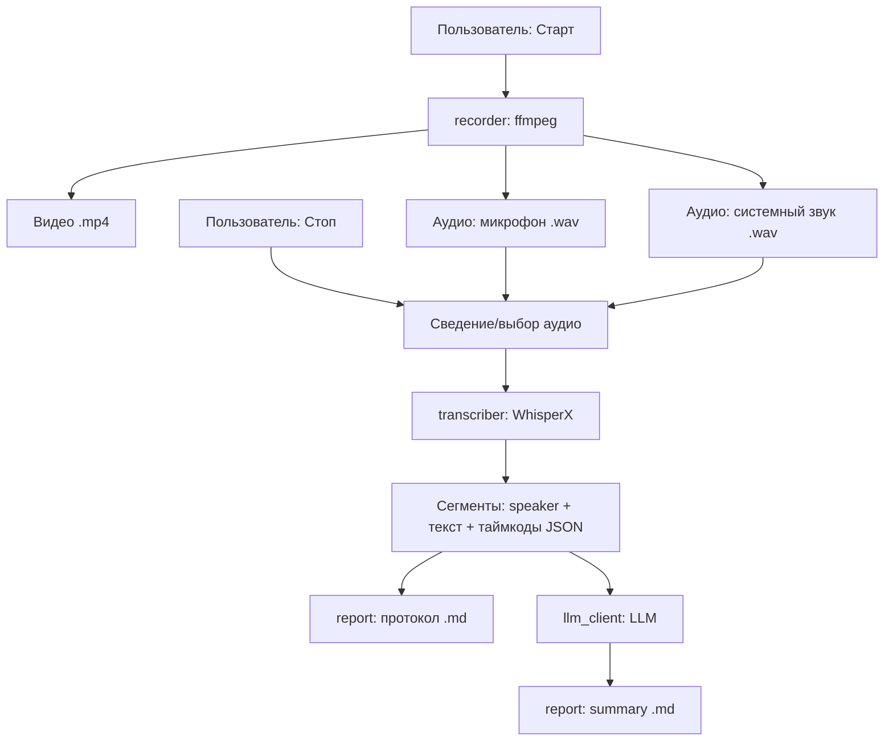

# Спецификация приложения «Meeting Recorder»

**Версия документа:** 1.0
**Платформа:** Windows 10 / 11 (x64)
**Язык реализации:** Python 3.11+
**Тип:** Внутренний инструмент (desktop, для собственного использования)

---

## 1. Назначение и цели

Приложение по запросу пользователя записывает **видео экрана** и **аудио** (микрофон + системный звук) в файлы, а затем на основе аудиозаписи формирует два текстовых артефакта:

1. **Протокол встречи** — структурированная, приближенная к дословной расшифровка с разметкой говорящих и временными метками.
2. **Summary-отчёт** — сжатый итог встречи: ключевые темы, принятые решения и список задач (action items).

Генерация текстовых артефактов выполняется большой языковой моделью (LLM) через один из двух взаимозаменяемых бэкендов:

- **Локальный** — `llama-server` (HTTP-сервер из состава llama.cpp) с OpenAI-совместимым API.
- **Облачный** — OpenRouter (также OpenAI-совместимый API).

### Ключевые принципы

- **Офлайн-приоритет.** При выборе локального бэкенда вся обработка (запись, транскрипция, диаризация, суммаризация) выполняется без выхода в интернет.
- **Постобработка, а не реальное время.** Транскрипция и генерация отчёта запускаются после завершения записи. Потоковая обработка в реальном времени не входит в область задачи.
- **Линейный воспроизводимый пайплайн.** Каждый этап имеет чёткие входы/выходы и может быть перезапущен отдельно над уже записанными файлами.

---

## 2. Область применения и ограничения

### В области задачи

- Запись экрана и звука на одной Windows-машине по команде пользователя.
- Автоматическое именование выходных файлов с датой и временем начала записи.
- Транскрипция с разметкой говорящих (диаризация).
- Генерация протокола и summary-отчёта через локальную или облачную LLM.

### Вне области задачи (на текущую версию)

- Потоковая транскрипция в реальном времени.
- Распространение приложения сторонним пользователям и установщики.
- Запись по сети / захват с других машин.
- Веб-интерфейс и серверный режим.
- Хранение и поиск по архиву встреч (БД).

---

## 3. Системные требования

| Категория | Требование |
|-----------|-----------|
| ОС | Windows 10 (21H2+) или Windows 11, x64 |
| Python | 3.11 или новее |
| Внешние бинарники | `ffmpeg` (в `PATH` или рядом с приложением) |
| ОЗУ | минимум 8 ГБ; рекомендуется 16 ГБ+ |
| GPU (опционально) | NVIDIA с CUDA — кратно ускоряет WhisperX и локальную LLM |
| Диск | свободное место под видео (≈0.5–2 ГБ на час) + модели (несколько ГБ) |
| Системный звук | устройство loopback (см. §6.2) |

---

## 4. Технологический стек

| Слой | Технология | Назначение |
|------|-----------|-----------|
| Захват экрана и звука | `ffmpeg` (вызов через `subprocess`) | Запись видео и двух аудиодорожек |
| Транскрипция + диаризация | **WhisperX** (`faster-whisper` + выравнивание + `pyannote.audio`) | Текст с пословными таймкодами и разметкой говорящих |
| LLM-клиент | `httpx` / `openai` SDK (OpenAI-совместимый) | Обращение к `llama-server` или OpenRouter |
| Конфигурация | `pydantic` + файл `config.yaml` | Типизированные настройки |
| Интерфейс | CLI (этап 1) → PySide6 (этап 2) | Управление записью и запуском обработки |
| Логирование | `logging` (stdout + файл) | Диагностика по этапам |

> Локальный и облачный LLM-бэкенды используют один и тот же OpenAI-совместимый протокол `/v1/chat/completions`, поэтому отличаются только значениями `base_url`, `api_key` и `model`. Это позволяет реализовать **единый клиент** и переключаться конфигурацией.

---

## 5. Архитектура

### 5.1 Модули

```
meeting_recorder/
├── __main__.py          # точка входа (CLI / запуск GUI)
├── config.py            # загрузка и валидация config.yaml (pydantic)
├── recorder.py          # управление ffmpeg: старт/стоп записи
├── transcriber.py       # обёртка над WhisperX: аудио → сегменты
├── llm_client.py        # OpenAI-совместимый клиент (local | openrouter)
├── report.py            # сборка протокола и summary из сегментов + LLM
├── naming.py            # генерация имён файлов и идентификатора сессии
├── pipeline.py          # оркестрация этапов
├── prompts/             # шаблоны промптов (протокол, summary)
└── ui/                  # PySide6-интерфейс (этап 2)
```

### 5.2 Поток данных



### 5.3 Этапы как независимые операции

Каждый этап принимает идентификатор сессии (`session_id`) и работает с уже существующими файлами, поэтому возможны частичные перезапуски:

- `record` → создаёт видео и аудио.
- `transcribe` → создаёт `*_transcript.json` и `*_protocol.md` из аудио.
- `report` → создаёт `*_summary.md` из транскрипта.

CLI должен поддерживать запуск как полного пайплайна, так и отдельных этапов над ранее записанной сессией.

---

## 6. Функциональные требования

### 6.1 Запись (модуль `recorder`)

- **FR-1.** По команде пользователя (старт) приложение начинает захват экрана и звука. Время старта фиксируется и становится основой `session_id`.
- **FR-2.** По команде пользователя (стоп) запись корректно завершается, ffmpeg останавливается так, чтобы файлы остались валидными (graceful stop, не kill).
- **FR-3.** Видео сохраняется в формате **MP4 (H.264)**. Частота кадров и битрейт задаются в конфиге (по умолчанию 15–30 fps).
- **FR-4.** Аудио записывается **двумя отдельными дорожками**: микрофон и системный звук — каждая в свой WAV-файл (PCM 16-bit, 16 кГц или 48 кГц). Раздельные дорожки упрощают диаризацию: локальный участник уже отделён по источнику.
- **FR-5.** Во время записи в UI/консоль отображается индикатор (идёт запись, длительность).

### 6.2 Захват системного звука (важный нюанс)

В Windows прямого захвата системного звука средствами `ffmpeg dshow` «из коробки» нет. Допустимые подходы (выбор фиксируется в конфиге):

- Устройство **WASAPI loopback** через DirectShow-обёртку (например, `virtual-audio-capturer` из проекта *screen-capturer-recorder*).
- Виртуальный аудиокабель (VB-Audio Virtual Cable и аналоги).

Приложение при старте должно проверять доступность настроенного аудиоустройства и выдавать понятную ошибку, если устройство не найдено.

### 6.3 Именование файлов (модуль `naming`)

- **FR-6.** Имена генерируются автоматически, без ввода пользователя.
- **FR-7.** Базовый идентификатор сессии формируется из даты и времени **начала записи** в **файловобезопасном** формате (без двоеточий, недопустимых в Windows):

  ```
  session_id = meeting_<YYYY-MM-DD>_<HH-MM-SS>
  пример:     meeting_2026-06-05_14-30-12
  ```

- **FR-8.** Все артефакты одной встречи используют общий префикс `session_id`:

  | Артефакт | Имя файла |
  |----------|-----------|
  | Видео экрана | `meeting_2026-06-05_14-30-12.mp4` |
  | Аудио (микрофон) | `meeting_2026-06-05_14-30-12_mic.wav` |
  | Аудио (система) | `meeting_2026-06-05_14-30-12_system.wav` |
  | Сведённое аудио | `meeting_2026-06-05_14-30-12_mix.wav` |
  | Транскрипт (данные) | `meeting_2026-06-05_14-30-12_transcript.json` |
  | Протокол | `meeting_2026-06-05_14-30-12_protocol.md` |
  | Summary-отчёт | `meeting_2026-06-05_14-30-12_summary.md` |

- **FR-9.** Все файлы одной сессии складываются в отдельную подпапку `<output_dir>/<session_id>/`.
- **FR-10.** При коллизии (повтор в ту же секунду) к `session_id` добавляется суффикс `_2`, `_3`, …

### 6.4 Транскрипция и диаризация (модуль `transcriber`)

- **FR-11.** На вход подаётся аудио (сведённое или системная дорожка); на выход — структурированный транскрипт.
- **FR-12.** Используется WhisperX с моделью, заданной в конфиге (по умолчанию `large-v3`), язык — настраиваемый (по умолчанию `ru`).
- **FR-13.** Включена диаризация (`pyannote.audio`): каждому сегменту присваивается метка говорящего (`SPEAKER_00`, `SPEAKER_01`, …).
- **FR-14.** Результат сохраняется в `*_transcript.json` со схемой:

  ```json
  {
    "session_id": "meeting_2026-06-05_14-30-12",
    "language": "ru",
    "duration_sec": 3725.4,
    "segments": [
      {
        "start": 12.84,
        "end": 17.20,
        "speaker": "SPEAKER_00",
        "text": "Текст реплики."
      }
    ]
  }
  ```

- **FR-15.** Модели `pyannote` загружаются с HuggingFace под gated-лицензией: требуется **один раз** принять условия и указать токен в конфиге. После скачивания весов всё работает офлайн.
- **FR-16.** Если GPU доступен, WhisperX использует его (`device=cuda`); иначе — CPU (с предупреждением о скорости).

### 6.5 Протокол встречи (модуль `report`)

- **FR-17.** Протокол формируется из `*_transcript.json` в человекочитаемый Markdown с группировкой по говорящим и таймкодами:

  ```
  ## Протокол встречи — 2026-06-05 14:30

  **[00:12] SPEAKER_00:** Текст реплики...
  **[00:17] SPEAKER_01:** Ответ...
  ```

- **FR-18.** (Опционально, по флагу конфига) перед сохранением протокол прогоняется через LLM для лёгкой чистки (удаление слов-паразитов, расстановка пунктуации) — **без изменения смысла**.
- **FR-19.** Метки говорящих по умолчанию обезличены (`SPEAKER_00`); должна быть возможность задать в конфиге сопоставление меток с именами участников.

### 6.6 Summary-отчёт (модули `report` + `llm_client`)

- **FR-20.** Summary генерируется LLM на основе полного транскрипта по шаблону промпта из `prompts/`.
- **FR-21.** Структура отчёта (фиксированная, задаётся промптом):

  - Дата, время, длительность встречи;
  - Участники (по меткам/именам говорящих);
  - Краткое резюме (2–4 абзаца);
  - Ключевые обсуждённые темы;
  - Принятые решения;
  - Список задач (action items) с указанием ответственного, если он озвучен;
  - Открытые вопросы / следующие шаги.

- **FR-22.** Если транскрипт превышает контекстное окно модели, текст разбивается на части (chunking) с последующей агрегацией промежуточных резюме (map-reduce).
- **FR-23.** Отчёт сохраняется в `*_summary.md`.

### 6.7 Выбор LLM-бэкенда (модуль `llm_client`)

- **FR-24.** Бэкенд выбирается в конфиге: `llm.backend = "local" | "openrouter"`.
- **FR-25.** Оба режима используют OpenAI-совместимый endpoint `POST /v1/chat/completions`. Различаются только параметры:

  | Параметр | local (`llama-server`) | openrouter |
  |----------|------------------------|------------|
  | `base_url` | `http://127.0.0.1:8080/v1` | `https://openrouter.ai/api/v1` |
  | `api_key` | произвольный/пустой | ключ OpenRouter |
  | `model` | имя загруженной модели | напр. `meta-llama/llama-3.1-70b-instruct` |

- **FR-26.** При недоступности бэкенда (нет ответа от `llama-server`, ошибка авторизации OpenRouter) приложение выдаёт понятную ошибку и **не теряет** уже записанные аудио/видео и транскрипт — отчёт можно перегенерировать позже.
- **FR-27.** Параметры генерации (`temperature`, `max_tokens` и т. п.) задаются в конфиге.

---

## 7. Конфигурация

Файл `config.yaml` рядом с приложением. Пример:

```yaml
output_dir: "C:/Meetings"

recording:
  fps: 20
  video_codec: "libx264"
  audio_sample_rate: 48000
  mic_device: "Микрофон (Realtek)"          # имя dshow-устройства
  system_audio_device: "virtual-audio-capturer"
  screen_grabber: "ddagrab"                 # ddagrab | gdigrab

transcription:
  model: "large-v3"
  language: "ru"
  diarization: true
  device: "cuda"                            # cuda | cpu
  hf_token: "hf_xxx"                         # токен HuggingFace для pyannote
  speaker_names:                            # опциональное сопоставление
    SPEAKER_00: "Иван"
    SPEAKER_01: "Мария"

llm:
  backend: "local"                          # local | openrouter
  base_url: "http://127.0.0.1:8080/v1"
  api_key: ""
  model: "qwen2.5-14b-instruct"
  temperature: 0.3
  max_tokens: 2048
  clean_protocol: false                     # прогонять ли протокол через LLM
```

Чувствительные значения (`api_key`, `hf_token`) допускается переопределять переменными окружения.

---

## 8. Пользовательские сценарии

### Сценарий A — полная запись и обработка

1. Пользователь запускает приложение и нажимает **Старт**.
2. Идёт запись; отображается индикатор и длительность.
3. Пользователь нажимает **Стоп** — запись завершается, файлы сохранены.
4. Автоматически (или по кнопке **Обработать**) запускается транскрипция → протокол → summary.
5. По завершении пользователю показываются пути к `*_protocol.md` и `*_summary.md`.

### Сценарий B — повторная генерация отчёта

1. Пользователь указывает `session_id` уже записанной встречи.
2. Запускает только этап `report` (например, сменив модель или бэкенд LLM).
3. Получает обновлённый `*_summary.md` без повторной записи и транскрипции.

### CLI (этап 1)

```
mrec start                       # начать запись
mrec stop                        # остановить запись и запустить пайплайн
mrec process <session_id>        # прогнать транскрипцию + отчёт
mrec report  <session_id>        # только перегенерация summary
```

---

## 9. Нефункциональные требования

- **NFR-1 (Приватность).** В режиме `local` данные не покидают машину. В режиме `openrouter` транскрипт отправляется во внешний сервис — приложение должно явно предупреждать об этом в логах/UI.
- **NFR-2 (Надёжность).** Сбой на этапе транскрипции или генерации отчёта не должен приводить к потере записанных видео/аудио.
- **NFR-3 (Идемпотентность).** Повторный запуск этапа над той же сессией перезаписывает соответствующий артефакт предсказуемо.
- **NFR-4 (Производительность).** На GPU обработка часовой встречи — единицы минут; на CPU допустимо медленнее реального времени (фиксируется как известное ограничение).
- **NFR-5 (Прозрачность).** Каждый этап логируется с таймингами; ошибки сопровождаются понятными сообщениями (какое устройство/токен/endpoint недоступны).
- **NFR-6 (Целостность файлов).** Остановка записи выполняется корректным завершением ffmpeg, гарантирующим валидный MP4.

---

## 10. Внешние зависимости

| Зависимость | Тип | Примечание |
|-------------|-----|-----------|
| `ffmpeg` | бинарник | захват экрана и звука |
| `whisperx` | pip | ASR + выравнивание + диаризация |
| `pyannote.audio` | pip | через WhisperX; нужен HF-токен |
| `torch` (+CUDA) | pip | бэкенд для WhisperX |
| `openai` или `httpx` | pip | OpenAI-совместимый LLM-клиент |
| `pydantic`, `pyyaml` | pip | конфигурация |
| `PySide6` | pip | GUI (этап 2) |
| `llama-server` | внешний | локальный LLM-бэкенд (llama.cpp) |
| Устройство loopback | система | захват системного звука |

---

## 11. Этапы реализации

- **Этап 1 — MVP (CLI).** Запись (видео + 2 дорожки), именование, транскрипция с диаризацией, протокол, summary через один бэкенд (`local`). Управление из командной строки.
- **Этап 2 — Бэкенды и устойчивость.** Переключение `local`/`openrouter`, chunking длинных встреч, перегенерация отчётов, корректная обработка ошибок устройств и endpoint'ов.
- **Этап 3 — GUI.** PySide6: кнопки старт/стоп/обработать, индикатор записи, список прошлых сессий, открытие готовых `.md`.

---

## 12. Возможные расширения (на будущее)

- Сопоставление меток говорящих с реальными именами полуавтоматически (по образцам голоса).
- Экспорт протокола/отчёта в `.docx` или `.pdf`.
- Архив встреч с поиском по содержимому.
- Горячие клавиши для старта/стопа без переключения окна.
